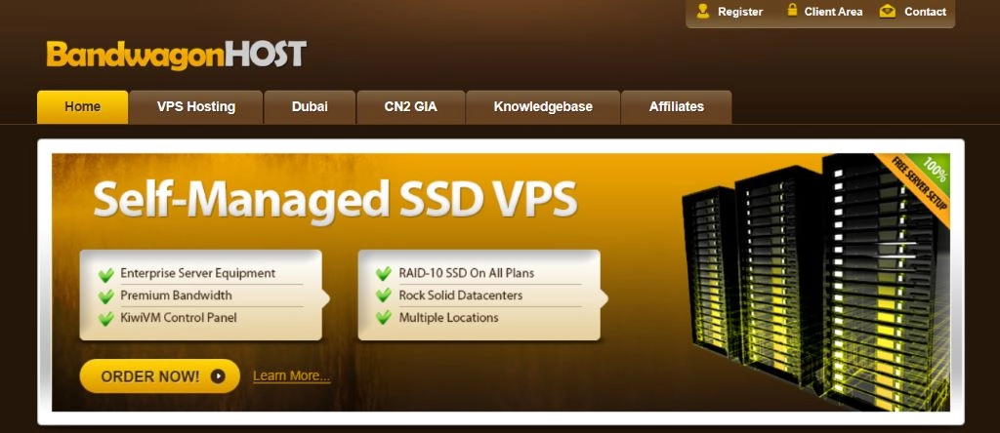

# 搬瓦工 VPS：真正适合国内用户的海外服务器

如果你正在寻找一台稳定、快速、价格合理的海外服务器，又不想在各种复杂的技术名词和机房选择中迷失方向，那这篇文章可能会帮到你。我会用最直白的方式，告诉你搬瓦工到底是什么，为什么值得考虑，以及怎么选不会踩坑。

---

## 搬瓦工是谁？

搬瓦工（BandwagonHost）2012年就开始做VPS了，背后是加拿大IT7 Networks这家公司。十几年下来，它在海外VPS圈子里算是站稳了脚跟。

最早的时候，搬瓦工靠"便宜"出名——年付19.9美元的套餐吸引了一大波用户。但现在不太一样了，它更注重质量而不是单纯拼价格。你可以理解为，从"性价比之王"慢慢转型成了"靠谱的高品质选择"。

### 怎么访问官网？

这里有个小麻烦：搬瓦工主站（bandwagonhost.com）在国内访问不太稳定。好在官方提供了专门优化过的镜像站，速度快多了。

**几个关键点：**
- 镜像站是官方维护的，不是什么第三方山寨站
- 数据和主站同步，功能完全一样
- 专门优化了国内访问线路
- SSL加密，支付和账户信息都安全

进入首页后，右上角有个"Client Area"，点进去就能注册或登录账户。如果是第一次买，建议先看看教程，注册、支付、配置都有详细步骤。

> **提示：** 镜像站地址可能会更新，如果遇到访问问题，可以找找最新的镜像地址。

### 搬瓦工的优势在哪？

说实话，搬瓦工现在的定位已经不是"最便宜的VPS"了。但它有几个确实做得不错的地方：

**网络线路：** 提供CN2 GIA、CMIN2、CUP等优化线路，专门针对国内用户做过调整。这不是说说而已，用过的人都知道，访问速度确实比普通线路快不少。

**硬件配置：** 用的是SSD存储，服务器硬件也是企业级的。不是那种随便拿几台机器就开始卖的小作坊。

**控制面板：** 自己开发的KiwiVM面板，界面简单直观，一键重装系统、实时监控这些功能都有。新手上手也不会太吃力。

**机房分布：** 美国、加拿大、荷兰、日本都有数据中心。不过对国内用户来说，美国洛杉矶的机房用得最多。

**稳定性保障：** 大部分套餐承诺99.95%的在线率，实际表现基本能达到99.97%。虽然偶尔也会有点小问题，但整体还算靠谱。

## 为什么我会推荐搬瓦工？

接触过不少海外VPS——Linode、DigitalOcean、Vultr这些都用过。对比下来，我还是会优先推荐搬瓦工，特别是对国内用户。

### 它真的懂国内网络环境

这是最核心的一点。很多海外服务商只是简单提供一台服务器，但搬瓦工会针对国内三大运营商做线路优化。这不是技术上有多高深，而是它真的在意国内用户的体验。

比如CN2 GIA线路，电信、联通、移动访问都快。这种针对性的优化，是很多纯海外服务商做不到或者懒得做的。

### 国内口碑确实不错

在技术圈子和站长社区里，搬瓦工的评价一直挺高。不是那种花钱买来的好评，而是用户真实反馈积累出来的口碑。

很多老用户都有个共识：**搬瓦工可能不是最便宜的，但绝对是最让人放心的。** 这种信任来自几个方面：

- 服务稳定，多年下来很少出大问题
- 价格透明，不会突然大幅涨价
- 老用户续费价格稳定，不搞新客户便宜老客户贵那一套
- 中文教程多，遇到问题容易找到解决方案

### 实用角度的几个理由

**学习成本低：** 中文教程铺天盖地，新手也能快速上手。这比那些只有英文文档的服务商友好太多了。

**网络优化到位：** CN2 GIA等线路确实能提供稳定快速的访问。这不是宣传说辞，是无数用户验证过的。

**性价比合理：** 虽然不是最便宜，但考虑到稳定性和网络质量，整体性价比还不错。👉 [想体验更稳定、更快速的VPS服务？搬瓦工CN2 GIA线路值得一试](https://bandwagonhost.com/aff.php?aff=79616)

更重要的是，选个靠谱的服务商能省不少麻烦。频繁迁移数据、重新配置环境，这些时间成本其实更高。

## 套餐怎么选？

搬瓦工的套餐挺多的，看着容易懵。根据我的使用经验，其实选择并不复杂。

### Basic VPS：性价比之选

如果你只是搭个人博客、小网站，或者就是想学习测试，Basic VPS完全够用。年付49.99美元的入门套餐，配置对新手来说绰绰有余。

**机房选择很重要：** 强烈推荐USCA_2机房。虽然不是顶级的CN2 GIA线路，但三网直连+美西地理位置，体验已经不错了。

有个小细节：虽然标注的是1 Gigabit带宽，但实际测试下来，服务器往往能跑到8-10 Gbps。网络不拥堵的时候，速度会超出预期。

### E-Commerce VPS：品质升级

如果你对服务质量有更高要求，或者跑电商网站、企业应用这种对稳定性敏感的业务，可以考虑E-Commerce VPS。

这个系列的核心优势是：
- 硬件配置更好
- 网络质量更稳定
- 带宽更充足

**机房选择建议：** 优先选洛杉矶的USCA_6或USCA_9机房，这两个提供三网优化线路（CN2 GIA、CMIN2、CUP）。

**特别注意：** 搬瓦工虽然在很多地方都有数据中心，但不是所有机房都针对国内优化。如果选了不熟悉的机房，可能会遇到没有优化线路的情况，访问速度就会很一般。建议严格按推荐的机房来选，能少踩不少坑。

### 日本和香港机房：土豪专属

搬瓦工也有日本东京和香港的机房，延迟确实低——通常能控制在50ms以内。但价格贵得离谱，往往是美国机房的3-5倍。

除非你有特殊的低延迟需求（比如实时游戏、金融交易），或者预算真的很充裕，否则我更建议选美国洛杉矶的CN2 GIA线路。性价比高多了。

## 常见问题

**支持哪些支付方式？**
支付宝、PayPal、信用卡都可以。国内用户用支付宝最方便，汇率也透明。

**可以退款吗？**
30天内、流量消耗不超过10%可以申请退款。这个条件已经比大部分服务商宽松了。

**能升级配置吗？**
可以升级到更高配置的套餐，系统会自动计算差价。但不支持自动降级，需要联系客服。

**机房可以换吗？**
可以免费换，但只能在同产品线的机房之间切换，而且迁移过程会消耗流量。

**提供中文客服吗？**
官方工单系统主要是英文，不过用中文也会得到响应，而且速度挺快。加上国内教程资源丰富，大部分问题都能自己解决。

**为什么官网有时访问不稳定？**
主站在国内访问确实不太稳定，所以官方提供了镜像站。建议找找最新的镜像地址，访问体验会好很多。

**流量用完了怎么办？**
服务器会被暂停，直到下个计费周期流量重置才恢复。也可以升级配置立即恢复。

**支持Windows系统吗？**
官方只提供Linux发行版，不过KiwiVM面板支持自定义安装Windows，就是需要点动手能力。

**搬瓦工靠谱吗？**
背后是加拿大IT7 Networks公司，运营超过10年了，业内口碑不错。99.9%以上的在线率承诺基本都能做到。

**新手该选哪个套餐？**
推荐Basic VPS年付49.99美元套餐+USCA_2机房。性价比最高，配置够用，学习和搭建小项目完全没问题。

---

## 总结

搬瓦工不是万能的，也不是最便宜的，但它确实是一个适合国内用户的靠谱选择。网络优化到位、服务稳定、教程资源丰富——这些优势对新手和老手都很实用。

如果你正在寻找一台海外VPS，又不想花太多时间踩坑试错，👉 [不妨从搬瓦工的Basic VPS开始尝试](https://bandwagonhost.com/aff.php?aff=79616)。年付不到350块钱，试错成本低，真不合适也能退款。

关键是，选个靠谱的服务商，能省下不少后续的麻烦。这比单纯追求便宜要值得多。
